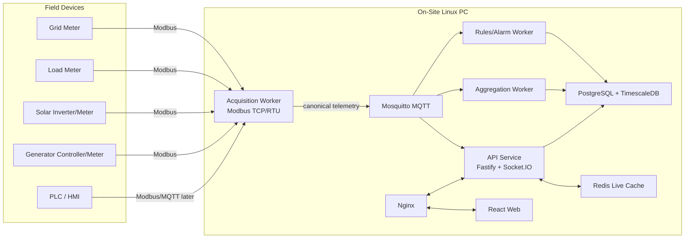

# System Architecture

## Architecture diagram

## Services

| Service | Responsibility |
|---|---|
| api | REST API, auth, RBAC, Socket.IO, live/history endpoints |
| acquisition-worker | poll devices, decode registers, publish telemetry |
| aggregation-worker | write raw/normalized telemetry and rollups |
| rules-worker | alarms, events, notifications later |
| web | React dashboard |
| postgres-timescale | config + historical data |
| redis | live cache + health state |
| mosquitto | local MQTT |
| nginx | reverse proxy and static web serving |

## Design principles

- local-first
- offline-capable
- driver-based
- canonical telemetry contract
- separated raw/live/history/alarms/audit data
- strict RBAC
- no unsafe writes
- visible service/device health
