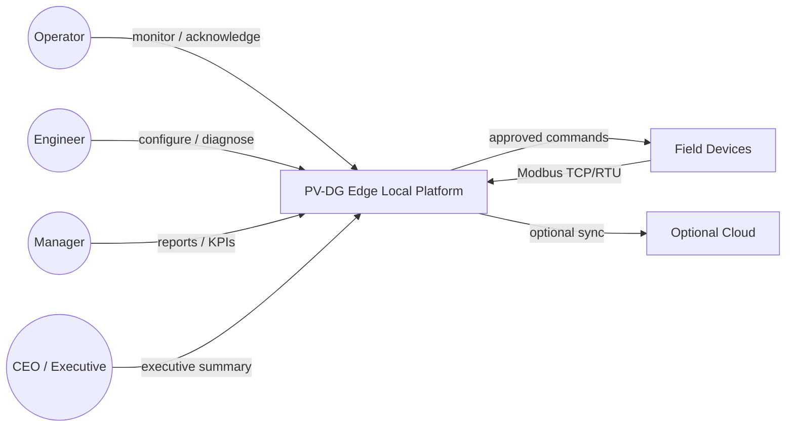
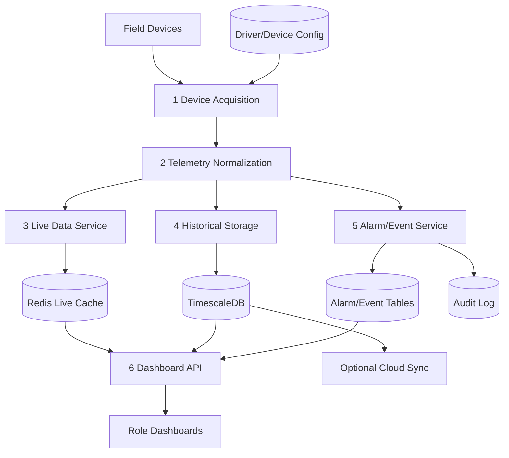
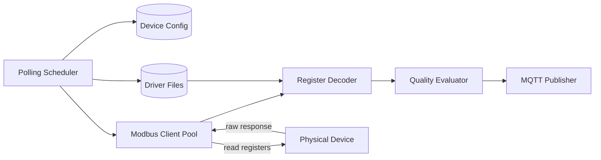
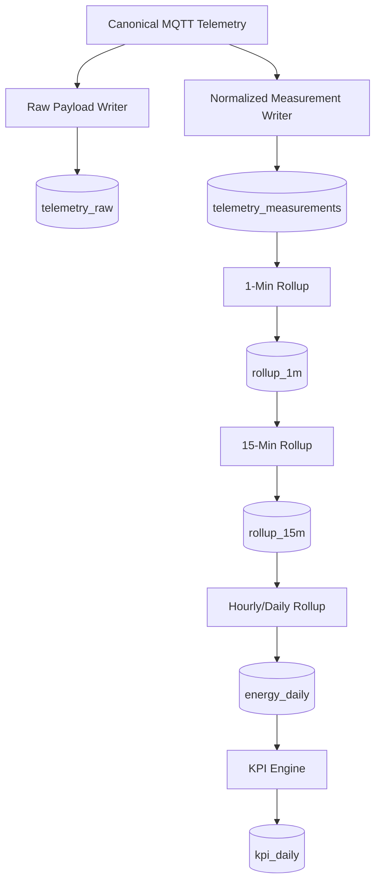
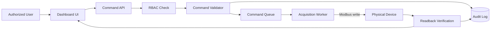

# Data Flow Diagrams

## Context DFD

```mermaid
flowchart LR
    Operator((Operator))
    Engineer((Engineer))
    Manager((Manager))
    Executive((CEO / Executive))
    Devices[Field Devices]
    Cloud[Optional Cloud]
    System[PV-DG Edge Local Platform]

    Devices -->|Modbus TCP/RTU| System
    System -->|approved commands| Devices

    Operator -->|monitor / acknowledge| System
    Engineer -->|configure / diagnose| System
    Manager -->|reports / KPIs| System
    Executive -->|executive summary| System

    System -->|optional sync| Cloud
```

## Level-1 DFD

```mermaid
flowchart TB
    Devices[Field Devices]
    P1[1 Device Acquisition]
    P2[2 Telemetry Normalization]
    P3[3 Live Data Service]
    P4[4 Historical Storage]
    P5[5 Alarm/Event Service]
    P6[6 Dashboard API]
    UI[Role Dashboards]
    Cloud[Optional Cloud Sync]

    D1[(Driver/Device Config)]
    D2[(Redis Live Cache)]
    D3[(TimescaleDB)]
    D4[(Alarm/Event Tables)]
    D5[(Audit Log)]

    Devices --> P1
    D1 --> P1
    P1 --> P2
    P2 --> P3
    P2 --> P4
    P2 --> P5
    P3 --> D2
    P4 --> D3
    P5 --> D4
    P5 --> D5
    D2 --> P6
    D3 --> P6
    D4 --> P6
    P6 --> UI
    D3 --> Cloud
```

## Device acquisition DFD

```mermaid
flowchart LR
    Scheduler[Polling Scheduler]
    Config[(Device Config)]
    Drivers[(Driver Files)]
    Client[Modbus Client Pool]
    Decoder[Register Decoder]
    Quality[Quality Evaluator]
    MQTT[MQTT Publisher]
    Device[Physical Device]

    Scheduler --> Config
    Scheduler --> Drivers
    Scheduler --> Client
    Client -->|read registers| Device
    Device -->|raw response| Client
    Client --> Decoder
    Drivers --> Decoder
    Decoder --> Quality
    Quality --> MQTT
```

## Historical data DFD

```mermaid
flowchart TB
    MQTT[Canonical MQTT Telemetry]
    Raw[Raw Payload Writer]
    Norm[Normalized Measurement Writer]
    R1[1-Min Rollup]
    R15[15-Min Rollup]
    R60[Hourly/Daily Rollup]
    KPI[KPI Engine]

    T1[(telemetry_raw)]
    T2[(telemetry_measurements)]
    T3[(rollup_1m)]
    T4[(rollup_15m)]
    T5[(energy_daily)]
    T6[(kpi_daily)]

    MQTT --> Raw --> T1
    MQTT --> Norm --> T2
    T2 --> R1 --> T3
    T3 --> R15 --> T4
    T4 --> R60 --> T5
    T5 --> KPI --> T6
```

## Safe command DFD

```mermaid
flowchart LR
    User[Authorized User]
    UI[Dashboard UI]
    API[Command API]
    RBAC[RBAC Check]
    Validator[Command Validator]
    Audit[(Audit Log)]
    Queue[Command Queue]
    Worker[Acquisition Worker]
    Device[Physical Device]
    Feedback[Readback Verification]

    User --> UI --> API --> RBAC --> Validator
    Validator --> Audit
    Validator --> Queue
    Queue --> Worker
    Worker -->|Modbus write| Device
    Device --> Feedback
    Feedback --> Audit
    Feedback --> UI
```
