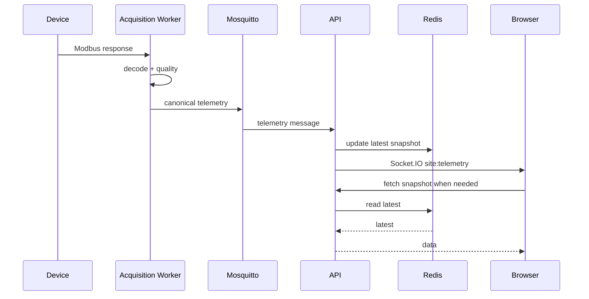

# Realtime Architecture

## Goal

Live screens should update quickly without constantly querying historical DB.

## Flow



## Socket.IO rooms

| Room | Use |
|---|---|
| site:{siteId} | live site updates |
| device:{deviceId} | engineering diagnostics |
| alarms:{siteId} | alarm changes |
| system | service health |

## Events

| Event | Direction |
|---|---|
| site:join | client to server |
| site:leave | client to server |
| device:join | client to server |
| device:leave | client to server |
| site:telemetry | server to client |
| device:status | server to client |
| alarm:changed | server to client |
| system:health | server to client |

## Redis keys

```text
live:site:{siteId}
live:device:{deviceId}
health:device:{deviceId}
alarms:active:{siteId}
service:health:{serviceName}
```

## Phase 4 implementation status

- The API process subscribes to `pvdg/+/+/telemetry` through the configured Mosquitto broker.
- MQTT telemetry payloads are validated against the canonical telemetry schema before Redis writes or Socket.IO events.
- Redis stores the most recent site and device snapshots under `live:site:{siteId}` and `live:device:{deviceId}`.
- Protected HTTP snapshot endpoints are available at:
  - `GET /api/v1/telemetry/live/site/{siteId}`
  - `GET /api/v1/telemetry/live/device/{deviceId}`
- Socket.IO is mounted at `/socket.io` and emits compact `site:telemetry` and `device:status` hints.

Current limitation: Socket.IO room joins are intended for the trusted local network in this phase. Token-authenticated Socket.IO handshakes and room authorization should be added before exposing realtime updates beyond the on-site LAN.

## Payload rule

Send compact Socket.IO hints, not huge full payloads.

Example:

```json
{
  "siteId": "uuid",
  "deviceId": "uuid",
  "ts": "2026-05-09T10:00:00Z",
  "changed": ["ac.power.total_kw"],
  "quality": 192
}
```
