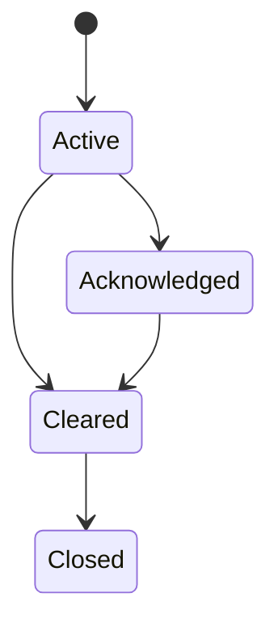

# Alarm and Event Management

## Alarm sources

- threshold rules
- device status bits
- communication failures
- stale telemetry
- service/database/MQTT failures
- command failures
- manual notes

## Severity

| Severity | Meaning |
|---|---|
| Critical | immediate action |
| High | serious issue |
| Medium | needs attention |
| Low | information/warning |

## Lifecycle

## Alarm fields

- id
- site id
- device id
- rule id
- severity
- status
- message
- first seen
- last seen
- acknowledged by/at
- cleared at
- source metric/value
- threshold
- notes

## Default communication alarms

- device offline
- stale data
- high timeout rate
- high CRC/error rate
- acquisition worker offline
- MQTT unavailable
- database unavailable

## Event types

- login/logout
- failed login
- config change
- driver import/export
- alarm create/ack/clear
- command requested/executed/failed
- backup/restore
- service restart
